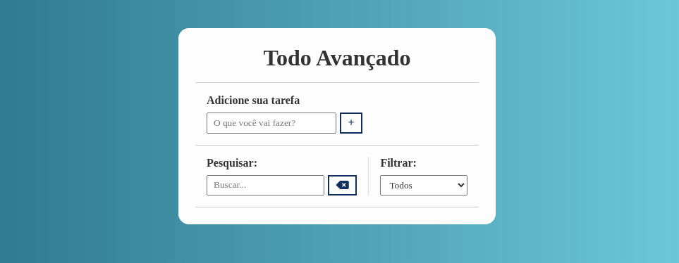
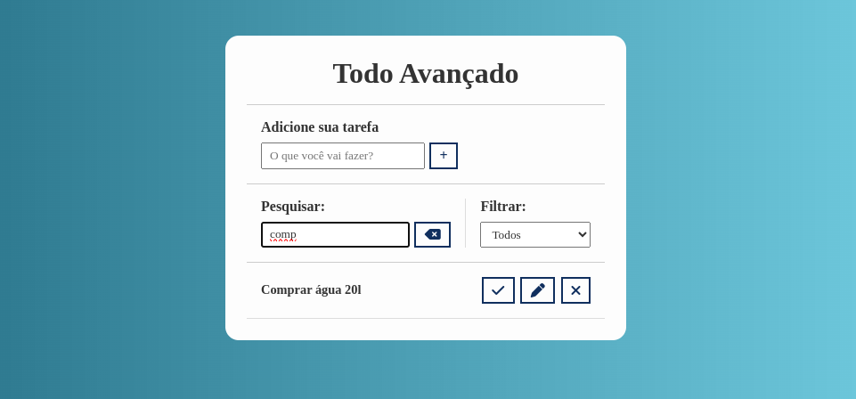
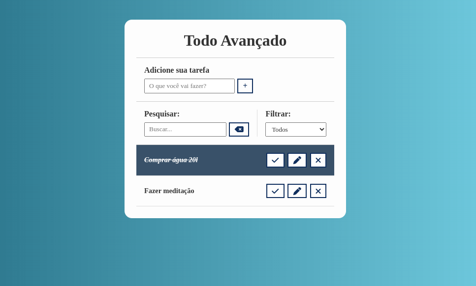

# Todo-list

## Projeto realizado utilizando HTML5, CSS3 e Javascript. É possível adicionar tarefas, apagá-las, fazer edição, marcar como concluída e filtrar os resultados.

  
  
  

# Funcionalidades

* Adicionar tarefa

* Pesquisar por tarefa já existente

* Filtrar tarefas específicas

* Editar tarefa, excluir e marcar como conluída
  
# Tecnologias Utilizadas

* JavaScript - Para lógica de programação 

* CSS - Para estilização da interface

# Como utilizar

1- Clone o projeto
`git@github.com:helen-andrade/todo-list.git`

2- Instale as dependências
`npm i`

3- Rode o script de desenvolvimento
`npm run dev`

---

    
Feito com ♡ por Helen Andrade

